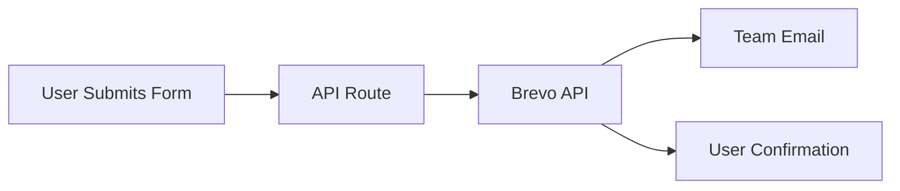

<div align="center">

# 🚀 Innovatech IT Solution

### Modern Business Website Built with Next.js 16 & React 19

**Student-friendly IT services in Palawan, Philippines**

[🌐 Live Demo](#) • [📖 Documentation](#getting-started) • [🐛 Report Bug](#support) • [✨ Request Feature](#support)

</div>

---

## 📋 Table of Contents

- [About Innovatech](#-about-tech-assist)
- [Features](#-features)
- [Development Tools](#️-development-tools)
- [Tech Stack](#-tech-stack)
- [Getting Started](#-getting-started)
- [Project Structure](#-project-structure)
- [API Routes](#-api-routes)
- [Pages](#-pages)
- [SEO Features](#-seo-features)
- [Design System](#-design-system)
- [Deployment](#-deployment)
- [Performance](#-performance)
- [Support](#-support)

---

## 🎯 About Innovatech

Innovatech IT Solution is your trusted partner for comprehensive IT services, specializing in student-friendly solutions across Palawan, Philippines.

### 📚 Project Purpose

This project was created as part of our **Marketing / ELEC 2 Subject** coursework. It's a fully functional business website that demonstrates modern web development practices and digital marketing strategies.

**🎁 Free to Use**: This project is free for anyone to use! Feel free to:
- Clone and customize for your own business
- Change images and content to match your brand
- Learn from the code structure and implementation
- Use it as a starting point for your projects

### Our Services

| Service | Description |
|---------|-------------|
| 🖨️ **Printing Services** | Passport photos, ID photos, documents, and photocopying |
| 🔧 **Troubleshooting** | Laptop, phone, tablet repairs and technical support |
| 💻 **Programming Services** | Custom software development and coding solutions |

---

## ✨ Features

<table>
<tr>
<td width="50%">

### 🎨 Design & UX
- ✅ Modern, responsive landing page
- ✅ Multi-section layout
- ✅ Animated UI components
- ✅ Smooth transitions
- ✅ Mobile-first design
- ✅ Glass morphism effects

</td>
<td width="50%">

### 🚀 Technical
- ✅ SEO optimized
- ✅ TypeScript support
- ✅ Email integration (Brevo)
- ✅ Dynamic sitemap
- ✅ Performance optimized
- ✅ Google Search Console ready
- ✅ Protected images (download prevention)

</td>
</tr>
</table>

---

## 🛠️ Development Tools

This project was built using industry-standard tools and platforms to ensure a smooth development workflow and reliable deployment.

| Tool | Description |
|------|-------------|
| **VS Code** | Primary code editor with extensions for React, TypeScript, and Tailwind CSS |
| **Vercel** | Deployment platform for hosting and continuous deployment |

---

## 🛠️ Tech Stack

[](https://nextjs.org) [](https://react.dev) [](https://www.typescriptlang.org) [](https://tailwindcss.com) [](https://prettier.io)

### Frontend Framework
```
Next.js 16.0.1    →  React framework with App Router
React 19.2.0      →  Latest UI library
TypeScript 5      →  Type-safe development
```

### Styling & UI
```
Tailwind CSS v4   →  Utility-first CSS framework
Lucide React      →  Modern icon library
PostCSS           →  CSS processing
```

### Backend & Services
```
Brevo API         →  Transactional email service
Next.js API       →  Serverless API routes
```

### Development Tools
```
ESLint            →  Code quality & linting
Prettier 3.6.2    →  Code formatting
Babel Compiler    →  React optimization
```

---

## 🎨 Code Formatting with Prettier

This project uses **Prettier 3.6.2** for consistent code formatting across the codebase.

### Configuration

Prettier is configured through `eslint.config.mjs` using `eslint-config-prettier` to ensure ESLint and Prettier work together without conflicts.

**Default Formatting Rules:**
```json
{
  "semi": true,
  "singleQuote": false,
  "tabWidth": 2,
  "trailingComma": "es5",
  "printWidth": 80
}
```

### Usage

#### Format All Files
```bash
npm run format
```
This will format all `.js`, `.jsx`, `.ts`, `.tsx`, `.json`, `.css`, and `.md` files in the `src/` directory.

#### Check Formatting (CI/CD)
```bash
npm run format:check
```
This checks if files are formatted correctly without making changes. Perfect for CI/CD pipelines.

#### Format on Save (VS Code)

Add to your `.vscode/settings.json`:
```json
{
  "editor.formatOnSave": true,
  "editor.defaultFormatter": "esbenp.prettier-vscode",
  "[typescript]": {
    "editor.defaultFormatter": "esbenp.prettier-vscode"
  },
  "[typescriptreact]": {
    "editor.defaultFormatter": "esbenp.prettier-vscode"
  }
}
```

### Custom Configuration (Optional)

To customize Prettier settings, create a `.prettierrc.json` file in the project root:

```json
{
  "semi": true,
  "singleQuote": false,
  "tabWidth": 2,
  "trailingComma": "es5",
  "printWidth": 80,
  "arrowParens": "always"
}
```

### Integration with ESLint

Prettier is integrated with ESLint through `eslint-config-prettier`, which:
- ✅ Disables ESLint rules that conflict with Prettier
- ✅ Allows both tools to work together seamlessly
- ✅ Ensures consistent code style across the project

---

## 🚀 Getting Started

### Prerequisites

Before you begin, ensure you have:

- ✅ **Node.js 18+** installed
- ✅ **npm** or **yarn** package manager
- ✅ **Brevo account** (optional, for email functionality)

### Installation

#### 1️⃣ Navigate to Project Directory

```bash
cd Tech-Assist
```

#### 2️⃣ Install Dependencies

```bash
npm install
```

#### 3️⃣ Configure Environment Variables

Create a `.env` file in the root directory:

```env
# Site Configuration
NEXT_PUBLIC_SITE_URL=http://localhost:3000

# Google Search Console (optional)
NEXT_PUBLIC_GOOGLE_VERIFICATION_CODE=your_verification_code

# Brevo Email Service (required for contact form)
BREVO_API_KEY=your_brevo_api_key
BREVO_SENDER_EMAIL=noreply@yourdomain.com
BREVO_SENDER_NAME=Innovatech
TEAM_EMAIL=your_team_email@example.com
```

#### 4️⃣ Start Development Server

```bash
npm run dev
```

#### 5️⃣ Open in Browser

Navigate to [http://localhost:3000](http://localhost:3000) 🎉

---

## 📁 Project Structure

```
Tech-Assist/
├── 📂 src/
│   └── 📂 app/
│       ├── 📂 components/
│       │   ├── 📂 landing/              # Landing page sections
│       │   │   ├── Hero.tsx             # Hero section with CTA
│       │   │   ├── MissionVision.tsx    # Mission & Vision
│       │   │   ├── About.tsx            # About section with stats
│       │   │   ├── Services.tsx         # Services showcase
│       │   │   ├── Team.tsx             # Team members
│       │   │   ├── Clients.tsx          # Partner schools
│       │   │   ├── Contact.tsx          # Contact form
│       │   │   ├── Navbar.tsx           # Navigation bar
│       │   │   ├── Footer.tsx           # Footer section
│       │   │   └── Credits.tsx          # Credits section
│       │   └── 📂 ui/                   # Reusable UI components
│       │       ├── Button.tsx
│       │       ├── Card.tsx
│       │       ├── Input.tsx
│       │       ├── Modal.tsx
│       │       ├── AnimatedBackground.tsx
│       │       └── ProtectedImage.tsx   # Protected image component
│       ├── 📂 api/
│       │   └── 📂 contact/
│       │       └── route.ts             # Contact form API endpoint
│       ├── 📂 utils/
│       │   ├── emailTemplate.ts         # Email HTML templates
│       │   ├── formatters.ts            # Data formatting utilities
│       │   └── validation.ts            # Form validation
│       ├── 📂 about/                    # About page
│       ├── 📂 services/                 # Services page
│       ├── 📂 team/                     # Team page
│       ├── 📂 clients/                  # Clients page
│       ├── 📂 contact/                  # Contact page
│       ├── page.tsx                     # Home page
│       ├── layout.tsx                   # Root layout with metadata
│       ├── globals.css                  # Global styles and Tailwind
│       ├── sitemap.ts                   # Dynamic sitemap generation
│       └── robots.ts                    # Robots.txt configuration
├── 📂 public/
│   ├── favicon.ico
│   └── googlec329ab47606a40b4.html      # Google verification
├── 📄 package.json
├── 📄 tsconfig.json
├── 📄 next.config.ts
├── 📄 postcss.config.mjs
└── 📄 eslint.config.mjs                 # ESLint config with Prettier integration
```

---

## 🔌 API Routes

### `POST /api/contact`

Handles contact form submissions and sends emails via Brevo.

#### Request Body

```json
{
  "name": "John Doe",
  "email": "john@example.com",
  "subject": "Service Inquiry",
  "message": "I need help with..."
}
```

#### Success Response

```json
{
  "success": true,
  "message": "Thank you for your message! We've sent you a confirmation email and will get back to you soon."
}
```

#### Error Response

```json
{
  "success": false,
  "message": "Error message details"
}
```

---

## 📧 Email Configuration (Brevo)

The contact form uses **Brevo** (formerly Sendinblue) for reliable email delivery.

### Setup Steps

1. **Create Account** → Sign up at [Brevo](https://www.brevo.com/)
2. **Get API Key** → Navigate to Settings > SMTP & API
3. **Configure Environment** → Add credentials to `.env` file
4. **Test Integration** → Submit a test form

### Email Flow



The system sends **two emails**:
- 📨 **Team Notification** - Inquiry details sent to your team
- ✅ **User Confirmation** - Acknowledgment sent to the user

---

## 📄 Pages

| Route | Description | Features |
|-------|-------------|----------|
| `/` | Main landing page | All sections with smooth scroll |
| `/about` | About page | Company information & values |
| `/services` | Services overview | Detailed service descriptions |
| `/team` | Team members | Team profiles & roles |
| `/clients` | Partner schools | Client logos |
| `/contact` | Contact form | Email integration |

> **Note:** All pages support smooth scroll navigation when accessed from the home page.

---

## 🔍 SEO Features

> **Status:** Currently in **beta/testing** phase

### Implemented Optimizations

<table>
<tr>
<td width="50%">

#### On-Page SEO
- ✅ Meta tags (title, description, keywords)
- ✅ Canonical URLs
- ✅ Semantic HTML structure
- ✅ Mobile-responsive design
- ✅ Fast loading times

</td>
<td width="50%">

#### Technical SEO
- ✅ Dynamic XML sitemap
- ✅ Robots.txt configuration
- ✅ Structured data (JSON-LD)
- ✅ Open Graph tags
- ✅ Twitter Cards
- ✅ Google Search Console ready

</td>
</tr>
</table>

### SEO Configuration Checklist

#### 1. Environment Variables

```env
NEXT_PUBLIC_SITE_URL=https://your-domain.com
NEXT_PUBLIC_GOOGLE_VERIFICATION_CODE=your_verification_code
```

#### 2. Update Metadata

Edit `src/app/layout.tsx`:
- Site title and description
- Target keywords
- Open Graph images

#### 3. Configure Structured Data

Edit `src/app/page.tsx`:
- Business name, phone, address
- Geo-coordinates
- Opening hours

#### 4. Submit to Search Engines

- ✅ Verify in Google Search Console
- ✅ Submit sitemap: `https://your-domain.com/sitemap.xml`
- ✅ Monitor indexing status

---

## 🎨 Design System

### Color Palette

```css
Primary Blue    →  #3B82F6
Primary Purple  →  #8B5CF6
Sky Blue        →  #0EA5E9
Dark Background →  #0A0E1A
Dark Secondary  →  #0F1419
```

### Typography Scale

| Class | Usage | Size |
|-------|-------|------|
| `heading-hero` | Hero headings | 4xl - 6xl |
| `heading-1` | Main headings | 3xl - 5xl |
| `heading-2` | Section headings | 2xl - 4xl |
| `heading-3` | Subsection headings | xl - 3xl |
| `heading-4` | Card headings | lg - 2xl |
| `body-large` | Large body text | lg - xl |
| `body-text` | Regular body text | base - lg |
| `body-small` | Small text | sm - base |

> **Note:** All typography classes include mobile-responsive variants.

### Component Styles

```css
glass-card       →  Glassmorphism effect (light)
glass-card-dark  →  Glassmorphism effect (dark)
gradient-bg      →  Animated gradient backgrounds
grid-pattern     →  Decorative grid overlays
```

### Protected Images

All images throughout the website are protected against downloading:
- ✅ Right-click context menu disabled
- ✅ Drag-and-drop prevention
- ✅ Long-press protection (mobile)
- ✅ User-select disabled
- ✅ Touch callout disabled (iOS)

**Usage:**
```tsx
import { ProtectedImage } from "@/components/ui/ProtectedImage";

<ProtectedImage
  src="/path/to/image.jpg"
  alt="Description"
  className="your-classes"
/>
```

---

## 📜 Available Scripts

| Command | Description |
|---------|-------------|
| `npm run dev` | Start development server on port 3000 |
| `npm run build` | Build optimized production bundle |
| `npm run start` | Start production server |
| `npm run lint` | Run ESLint code quality checks |
| `npm run format` | Format code with Prettier |
| `npm run format:check` | Check code formatting without changes |

---

## 🚀 Deployment

> **Note:** This project is deployed using **Vercel** for optimal performance and ease of deployment.

### Deploy on Vercel (Recommended)

#### Step 1: Prepare Repository
```bash
git init
git add .
git commit -m "Initial commit"
git push origin main
```

#### Step 2: Import to Vercel
1. Visit [Vercel](https://vercel.com)
2. Click "Import Project"
3. Select your repository

#### Step 3: Configure Environment Variables

Add the following in Vercel dashboard:

```env
NEXT_PUBLIC_SITE_URL=https://your-domain.vercel.app
BREVO_API_KEY=your_brevo_api_key
BREVO_SENDER_EMAIL=noreply@yourdomain.com
BREVO_SENDER_NAME=Innovatech
TEAM_EMAIL=your_team_email@example.com
NEXT_PUBLIC_GOOGLE_VERIFICATION_CODE=your_code
```

#### Step 4: Deploy! 🎉

### Post-Deployment Checklist

- [ ] Update `NEXT_PUBLIC_SITE_URL` to production domain
- [ ] Verify Google Search Console
- [ ] Submit sitemap to search engines
- [ ] Test contact form functionality
- [ ] Monitor email delivery in Brevo dashboard
- [ ] Check performance metrics
- [ ] Test on multiple devices

---

## 🎯 Features Showcase

### Landing Page Sections

1. **🎨 Hero Section**
   - Eye-catching gradient effects
   - Clear call-to-action buttons
   - Animated background elements

2. **🎯 Mission & Vision**
   - Company values and goals
   - Visual storytelling

3. **ℹ️ About Section**
   - Why choose Innovatech
   - Animated statistics counter
   - Key differentiators

4. **🏫 Clients Section**
   - Partner school logos
   - Trust indicators

5. **💼 Services Section**
   - Three main service categories
   - Expandable tech stack details
   - Interactive cards

6. **📧 Contact Section**
   - Functional contact form
   - Email integration
   - Real-time validation

7. **🔗 Footer**
   - Social media links
   - Quick navigation
   - Copyright information

### Animation Features

```
✨ Fade-in effects on scroll
🎭 Hover animations on cards
🎈 Floating background elements
🌊 Smooth scroll navigation
🔢 Counter animations for statistics
✨ Shimmer effects on interactive elements
```

---

## 🌐 Browser Support

| Browser | Version | Status |
|---------|---------|--------|
| Chrome | Latest | ✅ Fully Supported |
| Firefox | Latest | ✅ Fully Supported |
| Safari | Latest | ✅ Fully Supported |
| Edge | Latest | ✅ Fully Supported |
| iOS Safari | Latest | ✅ Fully Supported |
| Chrome Mobile | Latest | ✅ Fully Supported |

---

## ⚡ Performance

### Lighthouse Scores

```
Performance      →  90+
Accessibility    →  90+
Best Practices   →  90+
SEO             →  90+
```

### Key Metrics

| Metric | Target | Status |
|--------|--------|--------|
| First Contentful Paint | < 1.5s | ✅ |
| Time to Interactive | < 3s | ✅ |
| Largest Contentful Paint | < 2.5s | ✅ |
| Cumulative Layout Shift | < 0.1 | ✅ |

### Optimizations

- ✅ Optimized images with lazy loading
- ✅ Minimal JavaScript bundle size
- ✅ Code splitting and tree shaking
- ✅ Server-side rendering (SSR)
- ✅ Static generation where possible

---

## 📚 Learn More

Explore the technologies powering this project:

- 📖 [Next.js Documentation](https://nextjs.org/docs) - Learn about Next.js features and API
- ⚛️ [React Documentation](https://react.dev) - Official React documentation
- 🎨 [Tailwind CSS v4](https://tailwindcss.com/docs) - Utility-first CSS framework
- 📧 [Brevo API Documentation](https://developers.brevo.com/) - Email service integration
- 🎯 [TypeScript Handbook](https://www.typescriptlang.org/docs/) - TypeScript guide

---

## 📄 License

This project is **free and open for educational use**.


Feel free to use, modify, and distribute this project for your own purposes. Just remember to:
- Update the content and images to match your business
- Change the branding and company information
- Customize the color scheme and design to your preference

**© 2026 Innovatech IT Solution. All rights reserved to original content.**

---

## 💬 Support

Need help or have questions? We're here to assist!

### Contact Information

| Channel | Details |
|---------|---------|
| 📧 **Email** | Contact through the [website form](http://localhost:3000/contact) |
| 📱 **Phone** | +63-981-982-9768 |
| 📍 **Location** | Palawan, Philippines |

### Getting Help

1. **Bug Reports** - Use the contact form with detailed description
2. **Feature Requests** - Share your ideas through the contact page
3. **General Inquiries** - Reach out via phone or email

---

<div align="center">

### Built with ❤️ by Innovatech IT Solution Team

**Making Technology Accessible for Students**

[⬆ Back to Top](#-tech-assist-it-solution)

</div>